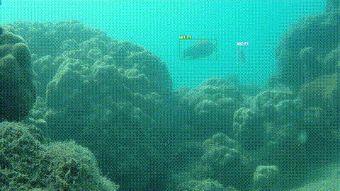

<div align="center">
    <h1>Underwater Fish Detection, Tracking, and Classification</h1>
    <h3>Authors: Valeria De Stasio, Christian Faccio, Carlos Velázquez Fernández</h3>
    <h6>Final project of the Deep Learning course - UniTs</h6>
</div>

<div align="center">
    
  </div>

  ---

This project implements a complete computer vision pipeline to process underwater video footage. The system is designed to perform three core tasks:

1.  **Detection**: Identify and locate fish within each frame of a video.
2.  **Tracking**: Assign a unique, persistent ID to each detected fish and follow it across multiple frames.
3.  **Classification**: Determine the specific species of each detected fish.

The pipeline is built to be flexible, offering multiple processing modes ranging from fast, real-time analysis for live camera feeds to more computationally intensive, high-accuracy offline processing for pre-recorded videos.

---

## Project Structure

The project is organized into the following directories to ensure a clean and scalable workflow:

```
Deep-Learning/
├── data/
│   └── ... (Contains raw datasets like F4K and DeepFish)
├── models/
│   └── ... (Contains the models, both pre-trained and fine-tuned for fishes)
├── outputs/
│   └── ... (Generated videos and data files are saved here)
├── presentation/
│   └── ... (Contains files for the presentation of the project)
├── src/
│   ├── main.py              # The main entry point for the application
│   ├── pipeline.py             
│   ├── object_detector/
│   │   └── train_yolo.py
│   │   └── ...
│   └── tracker/
│       ├── bytetrack.yaml
│       └── evaluate_f4k.py
├── theory/
│   └── papers/
│   └── ... (Contains all the theory regarding the YOLO models and its history)
└── README.md
```

* **`data/`**: Holds all the datasets used for training and evaluation.
* **`models/`**: Contains the final, trained model files (`.pt`).
* **`outputs/`**: The default location where all generated videos and data files are saved.
* **`src/`**: Contains all the Python source code.

> [!IMPORTANT]
> The **`data/`** folder is not present in the repository due to its weight.
> You can download the DeepFish dataset [here](https://www.kaggle.com/datasets/vencerlanz09/deep-fish-object-detection) (small version) or [here](https://alzayats.github.io/DeepFish/) (original version) and the Fish4Knowledge dataset [here](https://homepages.inf.ed.ac.uk/rbf/Fish4Knowledge/resources.htm).
> Then save them in the **`data/`** folder and run the converter script in **`src/object_detector`** to have the correct format.

---

## Model Preparation

The pipeline relies on a single, multi-class YOLOv8 model that must be trained beforehand.

**Training the Model (`deepfish_multi_m.pt`)**: This model is trained to detect and classify multiple fish species simultaneously in the DeepFish dataset. It should be trained using the `src/object_detector/train_yolo.py` script on a dataset that has bounding boxes labeled with their specific species. The relative model for F4K can be obtain fine-tuning the YOLOv8 model on the F4K dataset.

Ensure your final, trained `best.pt` model is placed in the `models/` directory.

You can run the `train_yolo.py` script using the commands in [this](src/object_detector/README.md) file.

---

## Running the Pipeline

The main entry point for all operations is `src/main.py`. You must run all commands from the project's root directory. The pipeline can process both **pre-recorded video files** and **live camera footage**.

### Input Sources

The `--source` argument determines the input type:
* **For a video file**, provide the full path to the file (e.g., `"data/f4k/gt_113.mp4"`).
* **For a live camera**, provide its numerical ID (e.g., `"0"` for the default system webcam).

### Operational Modes

The pipeline has two modes, selected with the `--mode` flag:

* **`standard`**: (Default) Optimized for speed. It displays the most confident species prediction for each track in real-time. Ideal for live camera feeds.
* **`buffered`**: A real-time capable mode that introduces a short delay. It only displays a track after it has been stable for a certain number of frames (`--min-duration`), reducing visual noise from fleeting detections.

### Example Commands

**Live Camera (Buffered Mode):**
```bash
# Use camera 0 and wait for 10 frames of stability
py src/main.py --source 0 --mode buffered --min-duration 10
```

**Pre-recorded Video (Standard Mode):**
```bash
py src/main.py --source "data/Deepfish/7398/train/output.mp4" --mode standard --yolo-model "models/fish.pt"
```

> [!NOTE]  
> This project was developed using Python 3.10


---

## Command-Line Arguments

You can customize the pipeline's behavior using the following arguments:

| Argument | Description | Default Value |
| :--- | :--- | :--- |
| **`--source`** | **[Required]** Path to the input video file or the camera ID (e.g., "0"). | `None` |
| `--yolo-model` | Path to the multi-class YOLO model for detection and classification. | `models/deepfish_multi_m.pt` |
| `--output-dir` | Directory where the annotated output videos will be saved. | `outputs` |
| `--mode` | The processing mode to use. | `standard` |
| `--tracker-config`| Path to the tracker's `.yaml` configuration file for tuning. | `bytetrack.yaml` |
| `--min-duration` | Minimum frames a track must exist to be considered stable. (Used in `buffered` mode).| `2` |


---

## References

- Fisher, R. B., Chen-Burger, Y.-H., Giordano, D., Hardman, L., & Lin, F.-P. (2016). *Fish4Knowledge: Collecting and Analyzing Massive Coral Reef Fish Video Data*. Springer.

- Saleh, A., Laradji, I. H., Konovalov, D. A., Bradley, M. D., Vazquez, D., & Sheaves, M. (2020). *A realistic fish-habitat dataset to evaluate algorithms for underwater visual analysis.* Scientific Reports, 10(1). [https://doi.org/10.1038/s41598-020-71639-x](https://doi.org/10.1038/s41598-020-71639-x)

- Zhang, Y., Sun, P., Jiang, Y., Yu, D., Weng, F., Yuan, Z., Luo, P., Liu, W., & Wang, X. (2022). *ByteTrack: Multi-Object Tracking by Associating Every Detection Box*. ArXiv:2110.06864 [cs]. [https://arxiv.org/abs/2110.06864](https://arxiv.org/abs/2110.06864)

- Yaseen, M. (2024). *What is YOLOv8: An In-Depth Exploration of the Internal Features of the Next-Generation Object Detector*. ArXiv.org. [https://arxiv.org/abs/2408.15857](https://arxiv.org/abs/2408.15857)

- Cui, M., et al. (2024). *Fish Tracking, Counting, and Behaviour Analysis in Digital Aquaculture: A Comprehensive Review.* ArXiv.org. [https://arxiv.org/abs/2406.17800](https://arxiv.org/abs/2406.17800)
