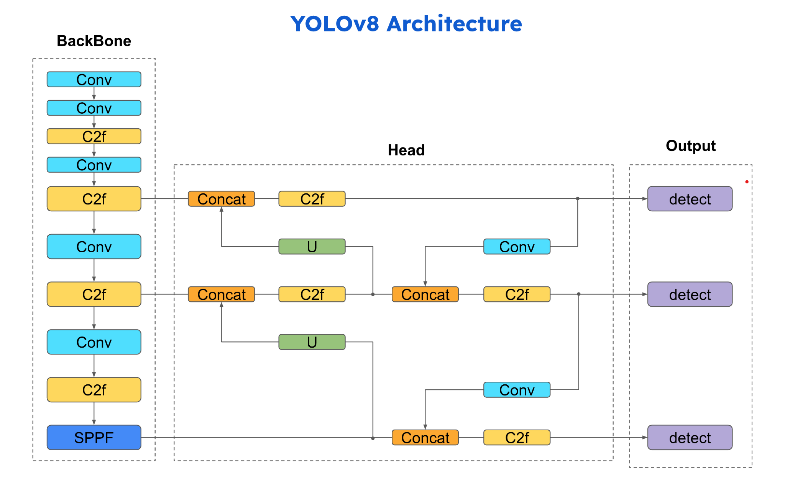
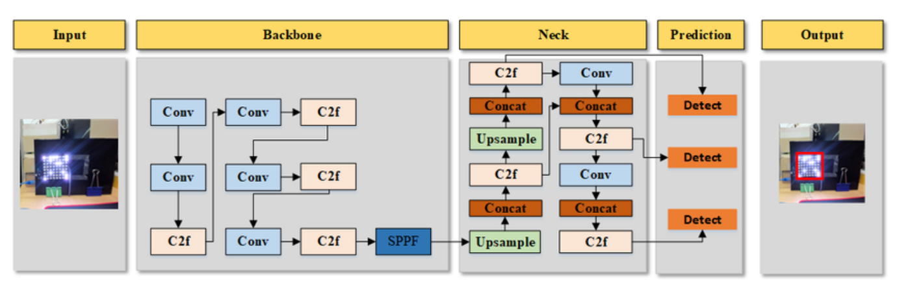
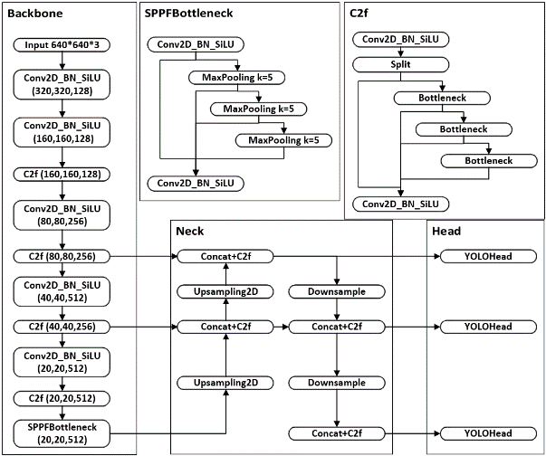
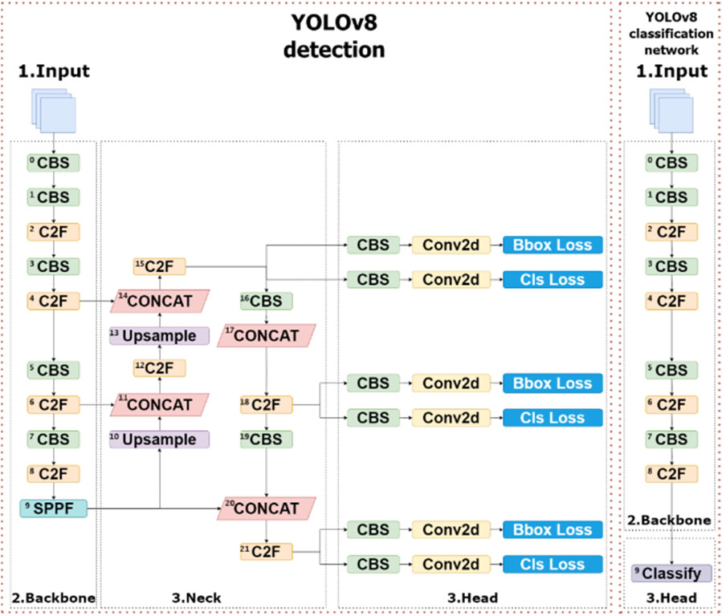

# YOLOv8 architecture

YOLOv8 is a model published by Ultralytics in 2023 based on the previous versions of YOLO (2015).

It is composed of:
- backbone: modified CSPDarknet
- neck: path-aggregation network (PANet) and a feature pyramid network (FPN)
- detached head: anchor-free convolutional layers, one head for each scale (small, medium, large) and two branches for each head (bounding boxes, class)

## Backbone
The purpose of the backbone is to extract multi-scale features from input images: it captures hierarchical feature maps that represent both low-level textures and high-level semantic information crucial for accurate object detection. Specifically, three effective feature maps are obtained, each of a different size.

The last layer is a SPPF structure based on serial plus parallel MaxPooling, which can effectively reduce the calculation amount of the network.

## Neck
The purpose of the neck is to refine and fuse the multi-scale features extracted by the backbone. It leverages an optimized version of the Path Aggregation Network (PANet). Or a FPN structure?

In this section the previously extracted feature layers of different sizes are combined together. 

## Head
The purpose of the head is to generate the final predictions (bounding box coordinates, object confidence scores and class labels) from the refined features obtained by the neck.

The main characteristics is that the head is **anchor-free**: the model predicts directly the coordinates of the center of Bounding Boxes (BBoxes) instead of predicting the offset with respect to pre-defined anchor boxes.

This enhances the flexibility of the model: we don't need to propose anchor boxes a priori, allowing for the boxes to be of any size and shape. Anchor boxes were introduced in YOLOv2 to reduce variance in the training, usually they were defined by looking at the shape and size of the most common boxes in the training dataset. This however can severely limit the performance of the model on custom datasets, hence the removal of anchor boxes. The removal of anchor boxes also reduces the number of predicted boxes, which speeds up the Non-Maximum Suppression (NMS).

It also adopts the Decouple Head structure and dynamic TaskAlignedAssigner tag matching strategy.

The Decouple Head structure uses two different branches to perform position prediction and class prediction to avoid the impact of different required feature information. The Decouple Head structure effectively improves the convergence speed and accuracy of the network but increases the computational complexity.

The TaskAligned label matching strategy uses a high-order combination of classification scores (good classifaction) and IoU (good detection) to select a certain number of anchors as positive samples for each instance, select the remaining anchors as negative samples, and then train through a loss function designed for the alignment of classification and localization. This way the network learns more efficiently where to predict objects.

### Loss used
- **focal loss**: loss that gives more weight to difficult-to-classify examples, so that the model learns more easily to find small objects. Otherwise, since many times the proposal anchor boxes do not actually contain objects this lead to class imbalance (too many negatives and few positives) and an inclination to not predict boxes
- **CIoU loss** for BBox regression

## Spatial Pyramid Pooling - Fast (SPPF) Bottleneck

## C2f

This block substitues the C3 block used in YOLOv5.

It is composed of:
- CBS layer: convolutional layer with a $3\times 3$ kernel with batch normalization and SiLu as activation function
- Split layer: a copy of the input layer is forwarded up in the network while the other is passed to the next layer
- Bottleneck layer: it's made of 2 convolutional layers, each with a $3\times 3$ kernel, with residual connections
The outputs of all the bottleneck layers and of the split layer are concatenated together and pass through a final CBS layer.

This module uses many jump-layer connections and Split operations, which can effectively enrich the gradient flow of the model.

# YOLOv8 training & post-processing

One essential part of the success of YOLOv8 is its training routine:
- **data augmentation**: specifically **mosaic augmentation** (multiple images put together into once to enhance the model's ability to learn objects in new locations), **Cutout** and **Mixup**
- **mixed-precision training** that combines 16-bit and 32-bit floating-point operations.
- **automated hyperparameter optimization** where multiple training experiments are run with different hyperparameters settings. 
- modified **Non-Maximal Suppression (NMS)** through optimized threshold settings and detection box sorting methods 
- **WAdam** gradient descent algorithm

# YOLOv8 Nano and Small versions
The YOLOv8 series includes the following models:
- YOLOv8n: This model is the most lightweight and rapid in the YOLOv8 series, designed for environments with limited computational resources. YOLOv8n achieves its compact size, approximately 2 MB in INT8 format and around 3.8 MB in FP32 format, by leveraging optimized convolutional layers and a reduced number of parameters. This makes it ideal for edge deployments, IoT devices, and mobile applications, where power efficiency and speed are critical. The integration with ONNX Runtime and TensorRT further enhances its deployment flexibility across various platforms.
- YOLOv8s: Serving as the baseline model of the YOLOv8 series, YOLOv8s contains approximately 9 million parameters. This model strikes a balance between speed and accuracy, making it suitable for inference tasks on both CPUs and GPUs. It introduces enhanced spatial pyramid pooling and an improved path aggregation network (PANet), resulting in better feature fusion and higher detection accuracy, especially for small objects.

All model sizes are obtained by scaling the width and depth of the layers using the parameters $w$ and $d$ in the YAML file and by limiting the maximum number of channels with $\text{max\_channels}$.

# YOLOv8 annotation format
The annotations are stored in a text file where each line corresponds to an object in the image. Each line contains the class label followed by the normalized coordinates of the bounding box (center_x, center_y, width, height) relative to the image dimensions.
This format is accompanied by a YAML configuration file, which specifies the model’s architecture and class labels.

# References:
- Yaseen "What is YOLOv8: An In-Depth Exploration of the Internal Features of the Next-Generation Object Detector" ()
- Guijin et al. "Enhancing semantic and spatial information yolov8" ()
- Jia et al. "Performance Optimization and Application Research of YOLOv8 Model in Object Detection" ()
- Talib et al. "YOLOv8-CAB: Improved YOLOv8 for Real-time object detection" ()
- Liu et al. "Path Aggregation Network for Instance Segmentation" ()
- He et al. "Spatial pyramid pooling in deep convolutional networks for visual recognition." (2015)
- Lin et al. "Feature pyramid networks for object detection." (2017)
